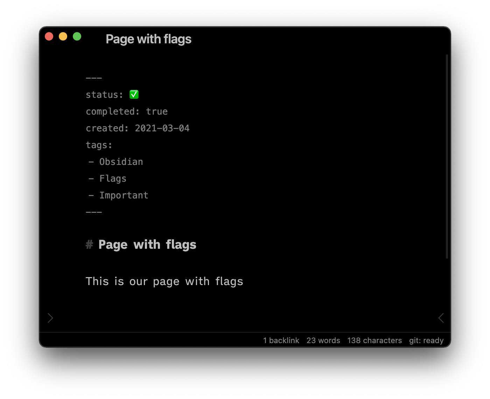

# Obsidian Link flags

[Link flags](https://github.com/vanniewelt/obsidian-link-flags) is an [Obsidian](https://obsidian.md/) plugin that enables you to display selected metadata from [front matter blocks](https://help.obsidian.md/Advanced+topics/YAML+front+matter) next to links. These pieces of metadata are called flags and they make it possible to aggregate data from multiple pages in a single place.

<figure>

<figcaption>Theme used in this example is <a href="https://github.com/kepano/obsidian-minimal">Minimal</a></figcaption>
</figure>

## Installation

You can install third-party plugins in *Settings* → *Community plugins* → *Browse*. Look for a plugin named “Link flags”. Don’t forget to enable the plugin after installation.

## Usage

By default, there no tags displayed. To display a flag next to a particular link, you have to:

- Populate linked page’s [YAML front matter](https://help.obsidian.md/Advanced+topics/YAML+front+matter) with your key-value pair
- Add the key in plugin settings (*Settings* → *Plugin options* → *Flags*).
- Open a *Preview mode*

> ⚠️ If you update flags’ settings or front matter while the preview mode is opened, the changes won’t take effect immediately. You have to close and reopen the editor for the change to take effect.

### Display options

- You can specify whether should be displayed **before** or **after links**
- Flags are listed **in order in which they’re specified in settings**.
- You can **hide a flag key and show only a value** by prepending a `-` to the key in the plugin’s settings (eg. `-status` will display `✅` instead of `status: ✅`)

The way the particular flag is formatted depends on its value:

| Type | Field | Display |
| --- | --- | --- |
| string or number | `rating: 5` | rating: 5 |
| `true` or object |  `completed: true` | completed |
| `false`, null or empty | `completed: false` | (*none*) |
| array of strings | `tags: [book, todo]`  | tags: book, todo |

### How they will look like?

Flags are **styled as tags**, so if your theme already applies any styles to tags, they will be also applied on flags. In the examples, I’m using [Minimal](https://github.com/kepano/obsidian-minimal) theme which styles tags very neatly.

### Can I customize flags’ appearance?

Yes, you can supply custom CSS to style them. Every flag element has `flag` class, `data-flag-key` and `data-flag-value` attributes so you can target them with CSS selectors. If you’re in doubt, use developer tools to inspect elements’ styles.

## Contributing

You can submit an issue or a pull request.
